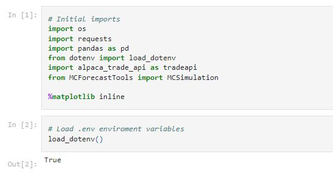
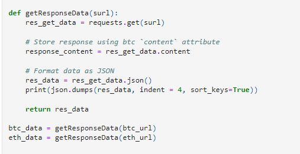
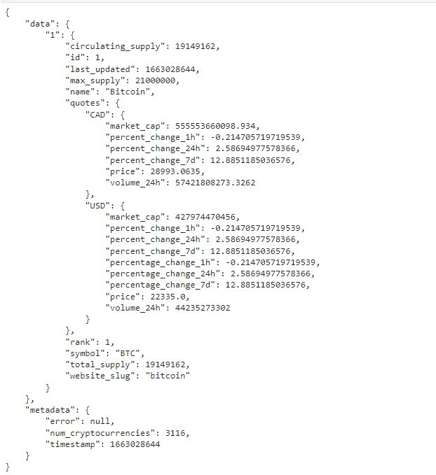
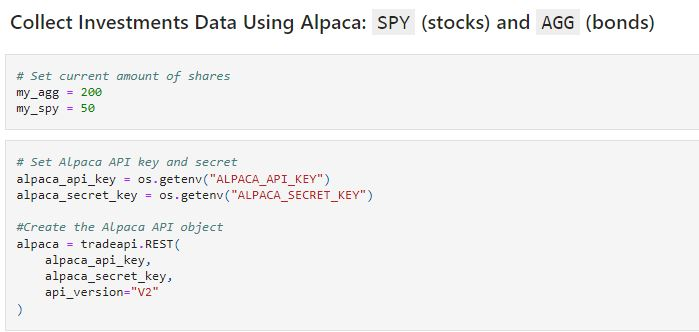
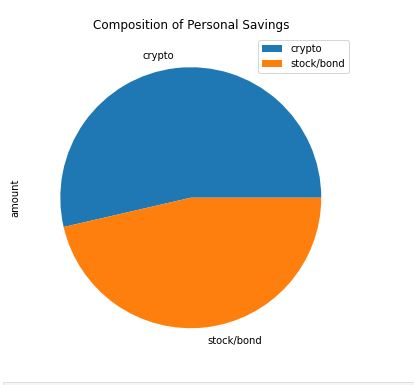
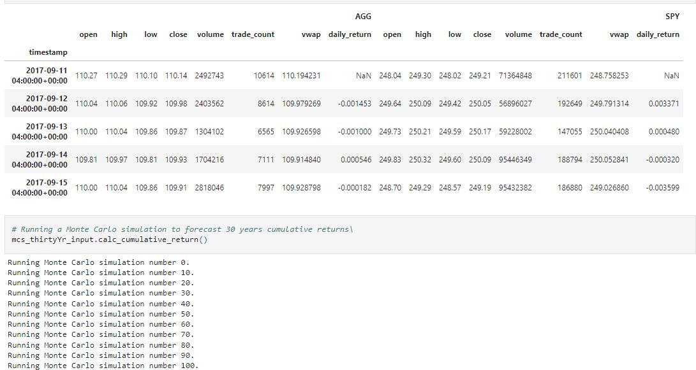
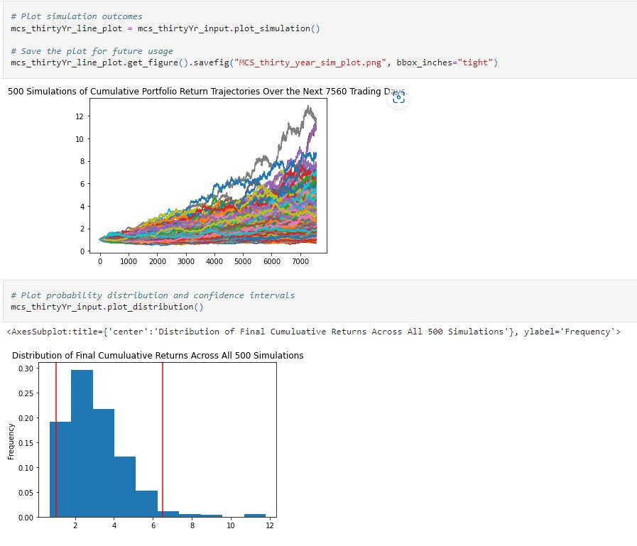
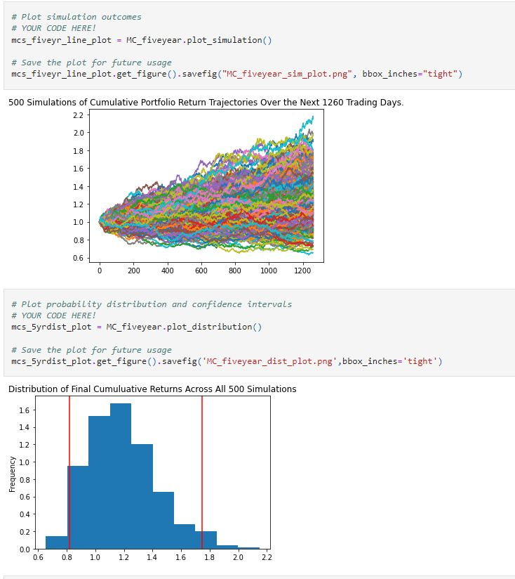
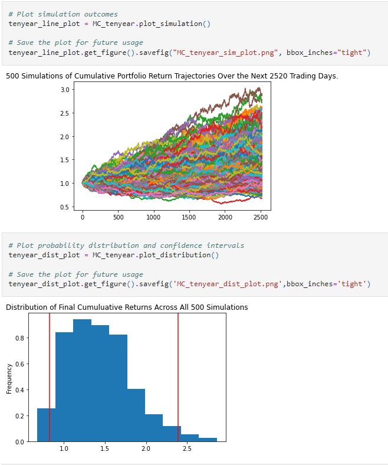

# Background
The project entails building a tool to help credit union members evaluate their financial health. Specifically, the credit union board wants the members to be able to do two things. 
* First, they should be able to assess their monthly budgets. 
* Second, they should be able to forecast a reasonably effective retirement plan based on their current holdings of cryptocurrencies, stocks, and bonds. 
The chief technology officer (CTO) of the credit union wants me to develop a prototype application to present at its next assembly.

# What You're Creating
Using the information from the Monte Carlo simulation to answer questions about the portfolio, I'll creating two financial analysis tools with a single Jupyter notebook:

* _Financial planner for emergencies._ The members will be able to use this tool to visualise their current savings. The members can then determine if they have enough reserves for an emergency fund.

* _Financial planner for retirement. This tool will forecast the performance of their retirement portfolio in 30 years. To do this, the tool will make an Alpaca API call via the Alpaca SDK to get historical price data for use in Monte Carlo simulations.

To achieve the above, the following libraries were imported and initialised

# Part 1: Create a Financial Planner for Emergencies
The prototype assumes the following:

* The average monthly household income for each credit union member is $12,000.
* Each credit union member has a savings portfolio that consists of a cryptocurrency wallet, stocks, and bonds.

## Evaluate the Cryptocurrency Wallet by Using the Requests Library
Determine the current value of a member’s cryptocurrency wallet. Collect the current prices for the Bitcoin and Ethereum cryptocurrencies by using the Python Requests library. For the prototype, assumes that the member holds the 1.2 Bitcoins (BTC) and 5.3 Ethereum coins (ETH). To do all this, complete the following steps:

    1. Create two variables called my_btc and my_eth. Set them equal to 1.2 and 5.3, respectively.
    2. Use the Requests library to get the current price (in Canadian dollars) of Bitcoin (BTC) and Ethereum (ETH) by using the API endpoints that the starter code supplied.
    3. Navigate the JSON response object to access the current price of each coin, and store each in a variable.

    **NOTE**
    : Note the specific identifier for each cryptocurrency in the API JSON response. The Bitcoin identifier is 1, and the Ethereum identifier is 1027.

    4. Calculate the value, in Canadian dollars, of the current amount of each cryptocurrency and of the entire cryptocurrency wallet.

### Simple function code to get the response data fro BTC and ETH

### Sample API Result in Jason

## Evaluate the Stock and Bond Holdings by Using the Alpaca SDK
In this section, it determines the current value of a member’s stock and bond holdings. Make an API call to Alpaca via the Alpaca SDK to get the current closing prices of the SPDR S&P 500 ETF Trust (ticker: SPY) and of the iShares Core US Aggregate Bond ETF (ticker: AGG). For the prototype, assume that the member holds 110 shares of SPY, which represents the stock portion of their portfolio, and 200 shares of AGG, which represents the bond portion. To do all this, complete the following steps:

**IMPORTANT**
Remember to create a *.env* file in your working directory to store the values of your Alpaca API key and Alpaca secret key.

    1. Create two variables named my_agg and my_spy and set them equal to 200 and 50, respectively.
    2.Set the variables for the Alpaca API and secret keys. Using the Alpaca SDK, create the Alpaca tradeapi.REST object. In this object, include the parameters for the Alpaca API key, the secret key, and the version number.
    3. Set the following parameters for the Alpaca API call:

        * **tickers**: Use the tickers for the member’s stock and bond holdings.
        * **timeframe**: Use a time frame of one day.
        * **start_date** and **end_date**: Use the same date for these parameters, and format them with the date of the previous weekday (or 2020-08-07). This is because you want the one closing price for the most-recent trading day.

    4. Get the current closing prices for SPY and AGG by using the Alpaca get_bars function. Format the response as a Pandas DataFrame by including the **df** property at the end of the **get_bars** function.
    5. Navigating the Alpaca response DataFrame, select the SPY and AGG closing prices, and store them as variables.
    6. Calculate the value, in dollars, of the current amount of shares in each of the stock and bond portions of the portfolio, and print the results.

### Defined Alpaca Keys and created objects

## Evaluate the Emergency Fund
In this section, use the valuations for the cryptocurrency wallet and for the stock and bond portions of the portfolio to determine if the credit union member has enough savings to build an emergency fund into their financial plan. To do this, complete the following steps:

    1. Create a variable called monthly_income and set its value to 12000.
    2. To analyze savings health, create a DataFrame called df_savings with two rows. Store the total value in dollars of the crypto assets in the first row and the total value of the shares in the second row.

### Savings Plot Chart

# Requirements Summary
Evaluate the Cryptocurrency Wallet by Using the Requests Library 
    1. Create a variable named monthly_income and set the value to 12000
    2. Use the Requests library to get the current price (in US dollars) of Bitcoin (BTC) and Ethereum (ETH)
    3. Navigate the JSON response object and store each current coin price in its respective variable.
    4. Calculate the value (in CAD dollars) of the current amount of each cryptocurrency.

## Evaluate the Stock and Bond Holdings by Using the Alpaca SDK (See defined Alpaca keys mentioned above)
To receive all points, you must:
    1. Create an .env file to store the values of the Alpaca API key and the Alpaca secret key.
    2. Create a tradeapi.REST object and parameters for the Alpaca API key, including the Alpaca secret key and version.
    3. Set the parameters for the Alpaca API call: tickers, timeframe, start_date, and end_date.
    4. Get the closing price for SPY and AGG by using the Alpaca get_bars function, and then use df to format as a Pandas DataFrame.
    5. Set the Alpaca response DataFrame for SPY and AGG as the variable.
    6. Calculate the value (in CAD dollars) of each stock with the current amount of shares.

## Evaluate the Emergency Fund (Result is represented with the above Savings Pie Chart)
To receive all points, you must:

    * Create a Python list named savings_data containing two elements: the total value of the cryptocurrency wallet and the total value of stock and bond portions of the portfolios. 
    * Use the savings_data list to create a Pandas DataFrame named savings_df. Include the following three parameters: savings_data, columns, and index
    * Plot the savings_df DataFrame as a pie chart that visualises the composition of each member's portfolio.
    * Use Python to determine if the current portfolio has enough funds to create an emergency fund that is three times the monthly income of the member. Display a print message that corresponds to the status of emergency funds available in the portfolio.

## Create the Monte Carlo Simulation
To receive all points, you must:

    * Make an API call via the Alpaca SDK to get 10 years of historical closing prices for a 60/40 portfolio: 60% stocks (SPY) and 40% bonds (AGG).
    * Run a Monte Carlo simulation for 500 samples and 30 years for the 60/40 portfolio and then plot the results.
    * Plot the probability distribution and confidence interval.
    * Generate summary statistics for the Monte Carlo simulation.

### Monte Carlo Simulation & Distribution

## Analyze the Retirement Portfolio Forecasts

        
## Forecast Cumulative Returns in 10 Years

